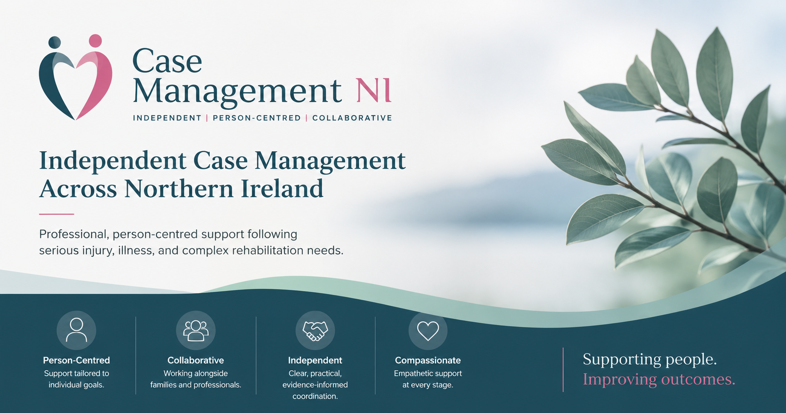

::: {.top-banner}

:::

::: {.hero-section role="banner"}

# Independent Case Management Across Northern Ireland

Professional, person-centred support following serious injury, illness, and complex rehabilitation needs.

[Contact Us](contact.qmd){.button-link}

:::

::: {.trust-badges role="list" aria-label="Credentials"}

[HCPC Registered]{role="listitem"}
[Northern Ireland Wide]{role="listitem"}
[Person-Centred Support]{role="listitem"}
[Collaborative Rehabilitation]{role="listitem"}

:::

## How We Help

::: {.service-card}
### Rehabilitation Coordination

We help coordinate therapy, care, equipment, community services, and ongoing support.
:::

::: {.service-card}
### Case Management

We work with clients, families, solicitors, insurers, and healthcare professionals to keep plans clear, joined up, and realistic.
:::

::: {.service-card}
### Person-Centred Support

Every plan is shaped around the person, their goals, their family, and their everyday life.
:::

::: {.highlight-box}
### Our Approach

Clear communication, practical planning, and compassionate support are at the centre of everything we do.
:::

## Our Focus

::: {.stats-grid}

::: {.stat-card}
### Person-Centred

Support tailored to individual goals and everyday life.
:::

::: {.stat-card}
### Collaborative

Working alongside families and professionals.
:::

::: {.stat-card}
### Independent

Clear, practical, evidence-informed coordination.
:::

:::

## What People Say {.visually-hidden-heading}

::: {.testimonial-grid}

::: {.testimonial-card}
"Professional, compassionate, and highly organised support throughout rehabilitation."

**Family member**
:::

::: {.testimonial-card}
"Clear communication and practical coordination made a complex situation much easier to manage."

**Solicitor**
:::

::: {.testimonial-card}
"The support felt calm, consistent, and genuinely person-centred."

**Client feedback**
:::

::: {.testimonial-card}
"Reliable, thoughtful, and focused on meaningful outcomes."

**Healthcare professional**
:::

:::

## Who We Help

::: {.audience-grid}

::: {.audience-card}
### Individuals

Support after serious injury, illness, or complex rehabilitation needs.
:::

::: {.audience-card}
### Families

Clear guidance and coordination when life feels complicated.
:::

::: {.audience-card}
### Solicitors

Collaborative case management support for medico-legal matters.
:::

::: {.audience-card}
### Healthcare Professionals

Joined-up working with therapists, clinicians, and support providers.
:::

:::

## Referral Pathway

::: {.pathway-strip}

:::: {}
**1** [Enquiry]{.pathway-label}
::::

:::: {}
**2** [Discussion]{.pathway-label}
::::

:::: {}
**3** [Assessment]{.pathway-label}
::::

:::: {}
**4** [Planning]{.pathway-label}
::::

:::: {}
**5** [Coordination]{.pathway-label}
::::

:::

## Current Industry Partners

<button class="partner-pause" onclick="const t=this.closest('.partner-banner').querySelector('.partner-track');const p=t.style.animationPlayState==='paused';t.style.animationPlayState=p?'running':'paused';this.textContent=p?'Pause':'Play'" aria-label="Pause scrolling">Pause</button>

Brain Injury Matters
Rehab Without Walls
NI Community Support Network
Independent Occupational Therapy Services
Case Management Society UK
Community Rehabilitation Providers
Brain Injury Matters
Rehab Without Walls
NI Community Support Network
Independent Occupational Therapy Services
Case Management Society UK
Community Rehabilitation Providers

::: {.final-cta}

## Ready to discuss a referral?

We are happy to have an initial conversation about whether case management support may be suitable.

[Make an Enquiry](contact.qmd){.button-link}

:::
